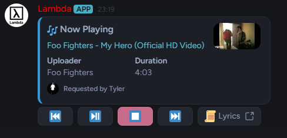
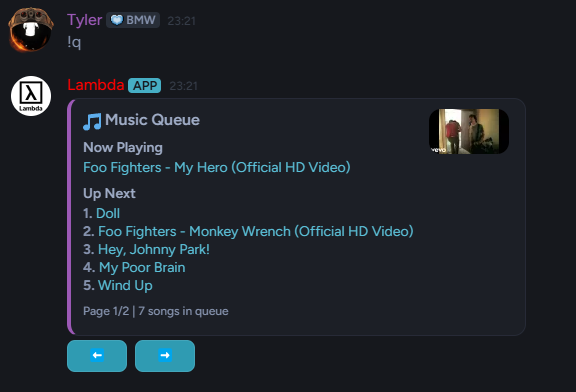
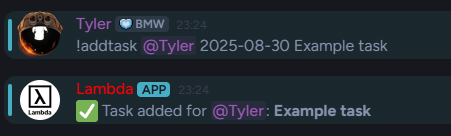
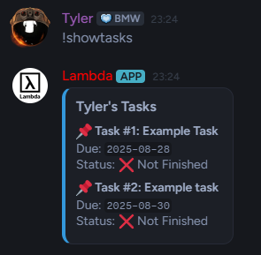
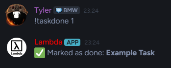
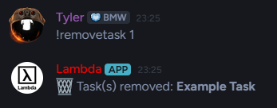

# Lambda - A Multi-purpose Discord Bot


[](https://github.com/tyler-bravin/Lambda-Discord-Bot/blob/master/LICENSE)

A comprehensive, multi-purpose Discord bot built with `discord.py`. It features a feature-rich, persistent music player and a server-specific task management system.

## ✨ Key Features

### 🎵 Music System
- **Wide Source Support**: Play music from YouTube and Spotify (tracks, playlists, and albums).
- **Persistent Queue**: The music queue is saved to a database, so it survives bot restarts.
- **Interactive Controls**: A modern UI with buttons for play/pause, skip, stop, previous, and lyrics.
- **Democratic Controls**: A vote-based system for skipping, stopping, and other actions ensures fair use.
- **Advanced Features**: Supports song/queue looping, volume control, and automatic disconnection when idle.

Here's a look at the interactive music player and queue:






### ✅ Task Management
- **Server-Specific Tasks**: Each Discord server has its own independent task board.
- **Assign & Track**: Assign tasks with due dates to specific members.
- **Persistent Storage**: Tasks are saved to a `tasks.json` file.
- **Automatic Reminders**: The bot automatically sends a DM to users one day before their task is due.
- **Admin Commands**: Server managers can view all tasks on the board.

See how easy it is to manage tasks:









## 🛠️ Setup & Installation

Follow these steps to get your own instance of the bot running.

### 1. Prerequisites
- [Python 3.10 or higher](https://www.python.org/)
- [Git](https://git-scm.com/)
- An empty Discord application and bot token. You can create one on the [Discord Developer Portal](https://discord.com/developers/applications).

### 2. Clone the Repository
Clone this repository to your local machine.
```bash
git clone https://github.com/tyler-bravin/lambda-bot.git
cd lambda-bot
```

### 3. Set up a Virtual Environment
It's highly recommended to use a virtual environment to manage dependencies.
```bash
# Windows
python -m venv .venv
.\.venv\Scripts\activate

# macOS / Linux
python3 -m venv .venv
source .venv/bin/activate
```

### 4. Install Dependencies
Install the dependencies using pip:
```bash
pip install -r requirements.txt
```

### 5. Configuration (`.env` file)
Copy `.env.example` to `.env` and fill in your values. This file stores your secret keys — **do not share or commit it** (it is already in `.gitignore`).

```bash
# Windows
copy .env.example .env

# macOS / Linux
cp .env.example .env
```

You will need:
- Your **Discord Bot Token**.
- A **Spotify API Client ID and Secret** (optional, for Spotify links). You can get these by creating an app on the [Spotify Developer Dashboard](https://developer.spotify.com/dashboard/).

All other variables in `.env.example` are optional tuning knobs; see the environment variable table in the Docker section below.

### 6. YouTube Cookies (Optional but Recommended)
To play **age-restricted videos** and prevent certain YouTube errors (like `HTTP Error 429: Too Many Requests`), you need a `cookies.txt` file.

1.  Install a browser extension that can export cookies in the `Netscape` format. A good one for [Chrome](https://chrome.google.com/webstore/detail/get-cookiestxt-locally/cclelndahbckbenkjhflpdbgdldlbecc) or [Firefox](https://addons.mozilla.org/en-US/firefox/addon/cookies-txt/) is **Get cookies.txt LOCALLY**.
2.  Log in to a YouTube account in your browser.
3.  Go to the YouTube homepage.
4.  Click the extension's icon and download the `cookies.txt` file.
5.  Place the downloaded `cookies.txt` file in the **root directory** of your bot project (the same place as your `.env` file).

### 7. Run the Bot
You can now start the bot using your main Python file (e.g., `main.py`).
```bash
python main.py
```

## 🐳 Deploying with Docker / Coolify

The repository ships with a `Dockerfile` and `docker-compose.yml`, so it can be deployed on any Docker host or on [Coolify](https://coolify.io/).

### Coolify
1. Create a new resource from this Git repository and pick the **Docker Compose** build pack (or **Dockerfile** if you prefer — then add a persistent volume mapped to `/data` yourself).
2. Set the environment variables (see the table below). Mark the tokens as secrets.
3. Deploy. The compose file creates a named volume at `/data` that persists the music queue database, task board, and cookies across redeploys.

### Plain Docker
```bash
docker compose up -d --build
```

### Environment Variables
| Variable | Required | Default | Description |
|---|---|---|---|
| `DISCORD_TOKEN` | ✅ | — | Your Discord bot token. |
| `SPOTIPY_CLIENT_ID` | | — | Spotify API client ID (Spotify links disabled without it). |
| `SPOTIPY_CLIENT_SECRET` | | — | Spotify API client secret. |
| `DATA_DIR` | | `.` (`/data` in Docker) | Directory for the database, `tasks.json`, cookies and yt-dlp cache. |
| `YTDLP_AUTO_UPDATE` | | `1` | Upgrade yt-dlp on container start **and** every 6 hours while running. Set `0` to disable. |
| `YTDLP_COOKIES` | | `$DATA_DIR/cookies.txt` | Explicit path to a Netscape-format YouTube cookies file. |
| `YTDLP_COOKIES_FROM_BROWSER` | | — | Read cookies from a local browser profile, e.g. `chrome` or `firefox:ProfileName`. Only for running the bot **outside** Docker, on a machine with a logged-in browser. |
| `POT_PROVIDER_URL` | | — (set in compose) | URL of the bgutil PO token provider sidecar. |

### How yt-dlp is kept working 24/7
YouTube frequently changes its player in ways that break older yt-dlp releases, so the bot:
- upgrades yt-dlp to the latest release **every time the container starts** (`entrypoint.sh`),
- checks for a new release **every 6 hours while running**; if one is installed, the bot restarts itself the next time no server is playing music, and the container's restart policy brings it straight back on the new version,
- runs the **bgutil PO token provider** sidecar (see `docker-compose.yml`), which answers YouTube's "confirm you're not a bot" attestation checks — the main reason server-hosted bots suddenly stop playing, and
- **writes rotated cookies back** to `cookies.txt` after every request, so an exported cookie file stays valid indefinitely instead of needing to be re-exported by hand.

A Docker `HEALTHCHECK` also reports the container unhealthy if the bot loses its Discord connection for more than ~90 seconds.

### YouTube cookies: set up once, never touch again
With the PO token provider, cookies are only needed for age-restricted or private videos. If you do want them, export them **once** the way the yt-dlp wiki recommends, and the bot keeps them fresh from then on:

1. Open a **private/incognito** window and log in to YouTube (ideally a throwaway account, in case it gets flagged).
2. Export cookies for `youtube.com` with a "Get cookies.txt LOCALLY"-style extension.
3. **Close the private window without logging out**, and never log in to that account from a normal browser session again — another browser using the same session is what invalidates exported cookies.
4. Put the file at `/data/cookies.txt` (on Coolify: a "File Mount" targeting `/data/cookies.txt`, or copy it into the volume). It must be **writable**, because the bot saves YouTube's rotated cookies back into it.

> **Why not `--cookies-from-browser` on the server?** That option reads cookies out of a browser profile installed on the same machine as yt-dlp. A headless container has no browser, so there is nothing to read from. It is supported here via `YTDLP_COOKIES_FROM_BROWSER` for people running the bot on a desktop PC next to a logged-in Chrome/Firefox.

## 🤖 Usage & Commands

Most commands work both as prefix commands (`!play`) **and** as slash commands (`/play`) — see [Slash commands](#slash-commands) below. The default prefix is `!`.

### Music Commands
| Command | Aliases | Slash | Description |
|---|---|---|---|
| `!play <song>` | `!p` | ✅ | Plays a song, URL, or Spotify/YouTube playlist. |
| `!pause` | | ✅ | Pauses the current song (requires votes). |
| `!stop` | | ✅ | Stops the music and clears the queue (requires votes). |
| `!skip` | `!s` | ✅ | Skips the current song (requires votes). |
| `!seek <MM:SS>` | | ✅ | Jumps to a position in the current song. |
| `!queue` | `!q` | ✅ | Displays the current song queue. |
| `!nowplaying` | `!np` | ✅ | Shows detailed info about the current song. |
| `!volume <0-200>`| `!vol` | ✅ | Sets the music volume for the server. |
| `!loop [song/queue/off]` | | ✅ | Sets the loop mode. Shows a menu if no mode is given. |
| `!autoplay` | `!radio` | ✅ | Toggles autoplay of related tracks when the queue empties. |
| `!shuffle` | `!shuf` | ✅ | Shuffles the queue (requires votes). |
| `!remove <number>`| `!rm` | ✅ | Removes a song from the queue by its number. |
| `!clear` | | ✅ | Clears all songs from the queue (requires votes). |
| `!disconnect` | `!dc` | ✅ | Disconnects the bot from the voice channel. |

### TaskBoard Commands
| Command | Slash | Description |
|---|---|---|
| `!addtask <@member> <YYYY-MM-DD> <task>` | ✅ | Adds a new task for a member. |
| `!showtasks [@member]` | ✅ | Shows your tasks or another member's tasks. |
| `!taskdone <number(s)>` | — | Marks one or more of your tasks as complete. |
| `!removetask <number(s)>` | — | Removes one or more of your tasks. |
| `!showalltasks` | ✅ | **(Admin Only)** Shows all tasks on the server. |

`!taskdone` and `!removetask` accept multiple numbers (e.g. `!taskdone 1 3 4`), which Discord's slash UI can't express, so they remain prefix-only.

### General & Admin Commands
| Command | Slash | Description |
|---|---|---|
| `!help [command]` | ✅ | Lists all commands, or shows details for one. |
| `!status` | ✅ | Uptime, latency, yt-dlp version, and active players. |
| `!reload` | — | **(Bot Owner Only)** Reloads all cogs. |
| `!ytdlp` | — | **(Bot Owner Only)** Forces an immediate yt-dlp update check. |
| `!sync` | — | **(Bot Owner Only)** Re-syncs slash commands with Discord. |

### Slash commands
Slash commands are registered automatically the first time the bot starts. Notes:
- The bot must be invited with the **`applications.commands`** scope (in addition to `bot`). If slash commands don't appear, re-invite it with that scope ticked in the Discord Developer Portal's OAuth2 URL generator.
- A **global** sync can take up to an hour to propagate the first time. For instant availability while testing, set the `TEST_GUILD_ID` environment variable to your server's ID — commands then sync to that one guild immediately.

## 🌐 TaskBoard Web Dashboard (optional)

Lambda ships with an **optional** web dashboard for the task board. It runs inside the bot process (no separate service), shares the bot's live task state, and lets users view, add, complete, and remove **their own** tasks from a browser. It's off unless you enable it.

Because it's part of your single bot deployment, one dashboard serves every server the bot is in — **Discord OAuth login scopes each person to just the servers they share with the bot**, and each user only ever sees their own tasks.

### Enable it
1. In the [Developer Portal](https://discord.com/developers/applications) → your app → **OAuth2**, add a redirect URL (e.g. `https://tasks.example.com/callback`, or `http://localhost:8080/callback` for local use), and copy the **Client ID** and **Client Secret**.
2. Set these environment variables (see `.env.example` for the full list):
   ```ini
   WEB_ENABLED=1
   DISCORD_CLIENT_ID=your_application_id
   DISCORD_CLIENT_SECRET=your_oauth2_client_secret
   WEB_REDIRECT_URI=https://tasks.example.com/callback
   WEB_SECURE=1          # when served over HTTPS
   WEB_SECRET_KEY=...     # python -c "import secrets; print(secrets.token_hex(32))"
   ```
3. On **Coolify**, expose the container's port (default `8080`) and point a domain at it; Coolify terminates HTTPS for you (so set `WEB_SECURE=1`). With plain `docker compose`, port `8080` is already published.

The dashboard is served at `/`; `/health` returns `ok` for uptime checks. If `WEB_ENABLED` is unset, no web server starts and none of the OAuth variables are needed.

### Live "Now Playing" screen
With the web server enabled, each server also gets a live music screen at `/np/<server_id>` — big album art, a progress bar, the upcoming queue with thumbnails, and **time-synced lyrics** (fetched from the free [LRCLIB](https://lrclib.net) database, with a Genius-search fallback when a song isn't found). Run `!player` (or `/player`) in Discord to get the link for that server. The view is **public and read-only** by default; it needs no login.

Optionally, set `WEB_CONTROLS=1` to add playback controls (play/pause, skip, previous, stop, volume). Controlling requires the user to **log in with Discord and be in the bot's voice channel** (admins can always control) — so the screen stays viewable by anyone, but only listeners can drive it. Set `WEB_BASE_URL` to your public URL so `!player` can build the link (it defaults to `WEB_REDIRECT_URI` without `/callback`).

## 📜 License
This project is licensed under the MIT License. See the `LICENSE` file for details.
